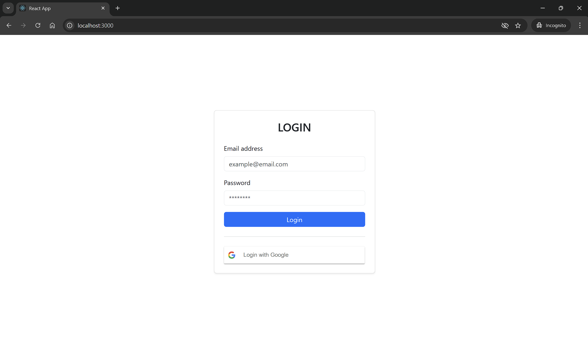

# Oauth Assignment
---
>**Install [node.js](https://nodejs.org/en) and [git](https://git-scm.com/downloads) if not installed (click lng 'node.js' or 'git' para mag auto).**

### Clone repo
```bash
git clone https://github.com/genjixxvi/Oauth.git
```

### navigate to the Folder
```bash
cd oauth
```

### Install required packages and dependencies
```bash
npm install
```

### start react project
```bash
npm start
```
---
### **OPEN WEB BROWSER**
> ## ```http://localhost:3000```

